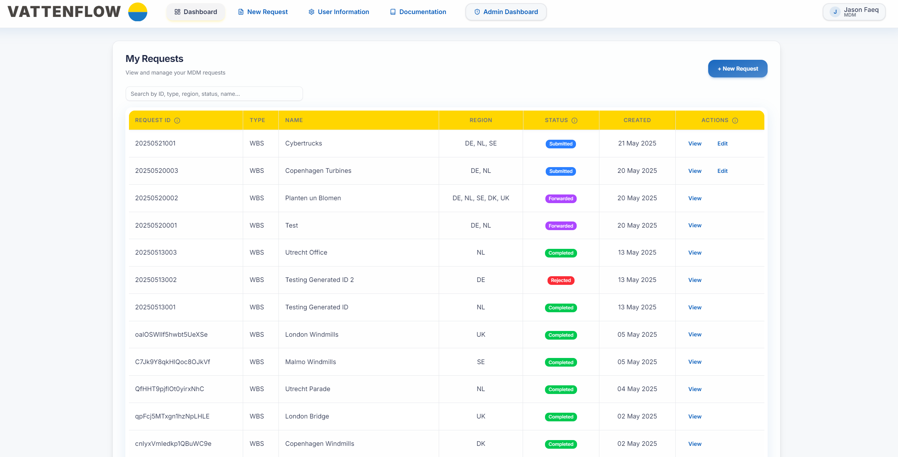
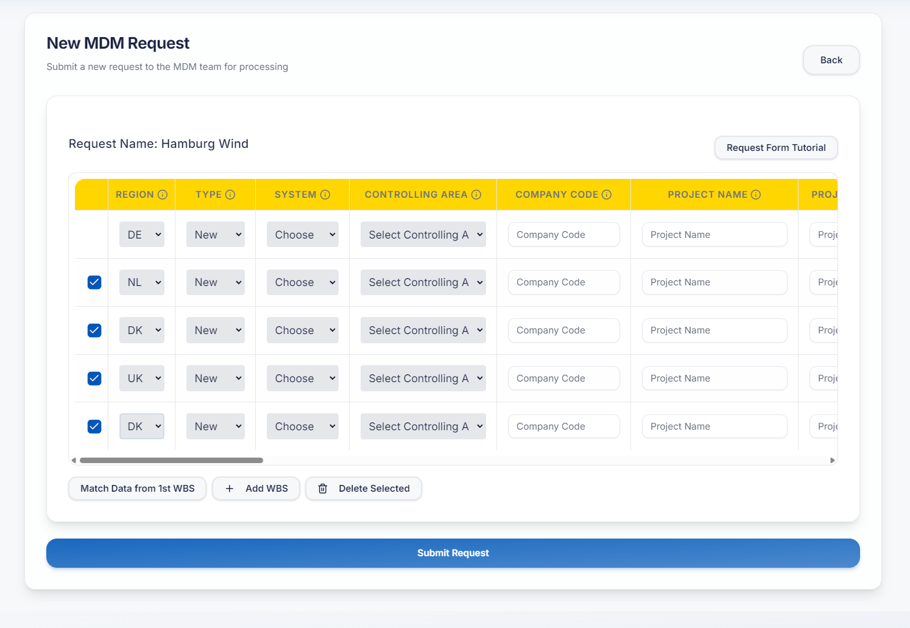
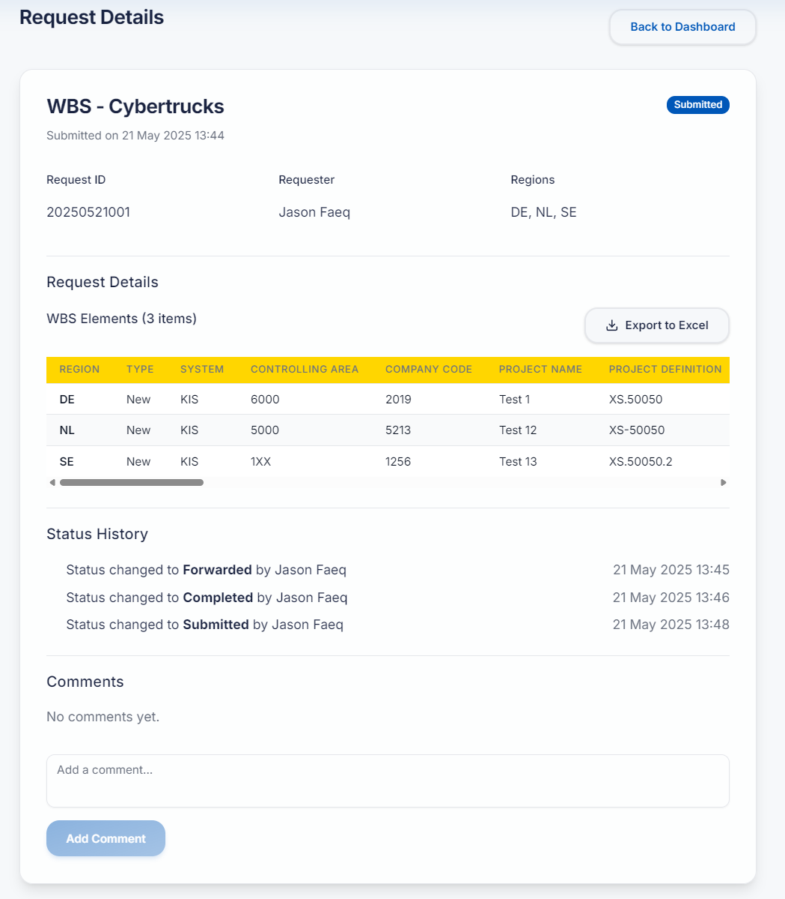
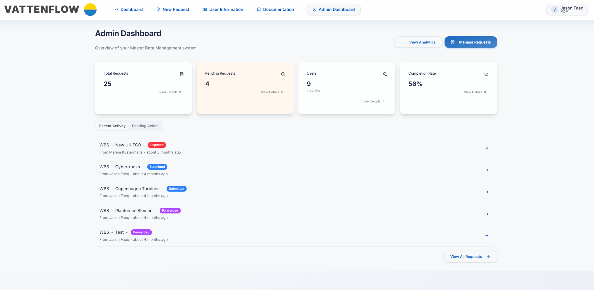
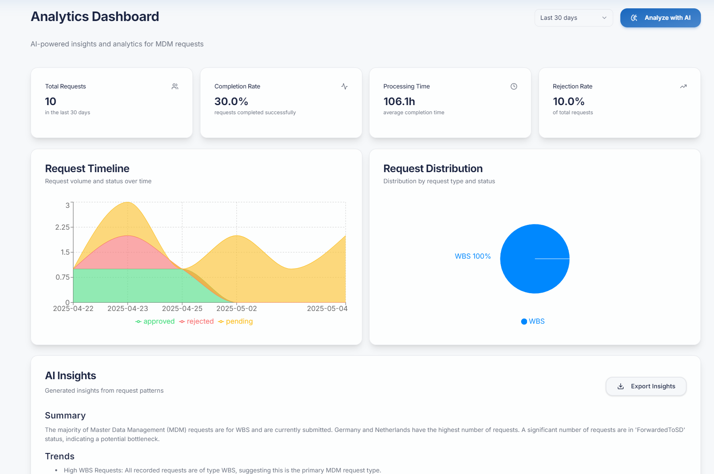

# MDM-Vattenflow (Public Version)

A web-based internal tool for managing WBS and Cost Center change requests—built to streamline SAP-related workflows between Controllers and Master Data Management (MDM) teams.

> 🚀 Originally prototyped inside Vattenfall, this version demonstrates a generic, public-facing version for showcasing architecture, validation logic, and full-stack design.

Live Version: https://mdm-vattenflow.vercel.app/

---

## 🔍 Overview

Traditional workflows for WBS and Cost Center management often rely on Excel templates, emails, and manual data re-entry—leading to:
- Data inconsistencies
- Rework and miscommunication
- Delayed invoice processing and audit risks

**MDM-Vattenflow** solves this by providing:
- A structured, role-based form interface
- Automated request tracking
- Excel-compatible export with macro-safe templates
- Real-time status updates between Controllers and Admins
- Export to a standardized, formatted Excel template.

---

## 📸 Screenshots

### 🧾 My Requests – Controller Homepage  

### ➕ Create New Request  

### 🪟 Request Overview & Excel Export

### 🛠️ Admin Panel – Homepage  

### 🛠️ Admin Panel – Request Management  

### 📊 AI-Powered Analytics (Prototype)  

---

## 🧩 Features

### 🎫 Controller Role
- Login with Firebase auth
- Submit new WBS/Cost Center requests
- Dynamic form fields (filtered by region and type)
- Add/remove multiple WBS elements
- Field validation (character limits, required values)
- Track status and comment on requests
- Export request to Excel (via backend API)

### 🔧 Admin Role
- Access request dashboard
- Change request statuses (e.g., Pending, Approved)
- Add comments and edit submissions
- View user metrics and system usage
- Analyze request flow (basic analytics included)

---

## 🛠 Tech Stack

| Layer        | Technology          |
|--------------|---------------------|
| Frontend     | React / Next.js     |
| Auth         | Firebase Auth       |
| Database     | Firebase Firestore  |
| Backend API  | Flask (Python) or Node.js |
| Excel Export | Python (`xlwings`) |

---

## 🔐 Demo Credentials

| Role       | Email                | Password     |
|------------|----------------------|--------------|
| Controller | johndoe@vattenflow.com | 123456     |
| Admin      | Message me please for Admin privileges. |

Note: The Export to Excel feature currently needs a VM for xlwings to properly export to an Excel pre-assigned template with Macros attached, which was required for the project. Hence, it won't function on this version.

---
